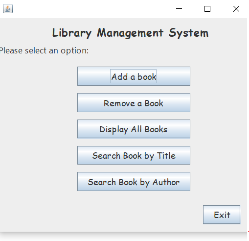
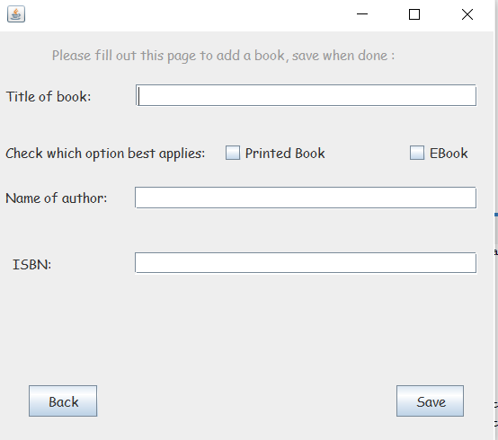
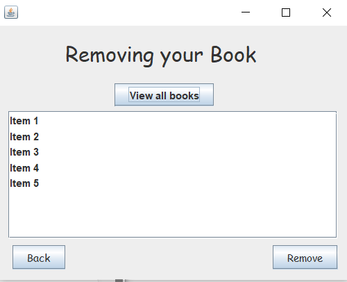
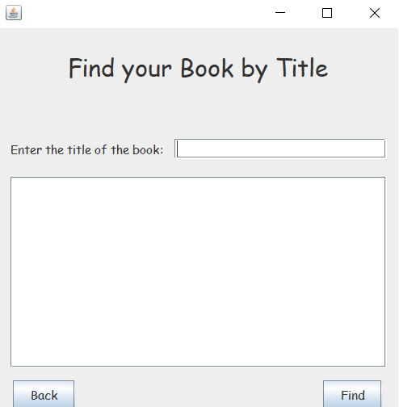
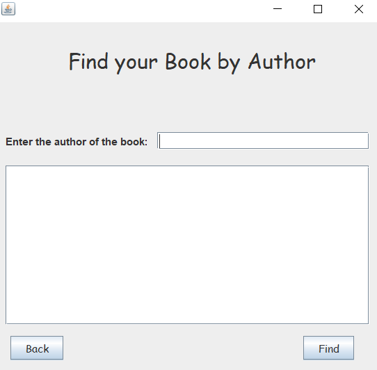

# Java Library Management System

A desktop library-management application built with Java Swing. The project uses object-oriented programming, inheritance, file storage, and a graphical interface to manage printed books and eBooks.

## Screenshots

<table>
  <tr>
    <td align="center"><br><b>Main Menu</b></td>
    <td align="center"><br><b>Add a Book</b></td>
  </tr>
  <tr>
    <td align="center"><br><b>Remove a Book</b></td>
    <td align="center"><br><b>Search by Title</b></td>
  </tr>
  <tr>
    <td colspan="2" align="center"><br><b>Search by Author</b></td>
  </tr>
</table>

## Quick Start

HOW I RUN PROJECT: SAVE ZIP, UPLOAD TO NETBEANS, RUN

Install **Java 22** and **Maven**, download and extract the repository, then:

- **Windows:** double-click `run.bat`
- **macOS/Linux:** run `chmod +x run.sh && ./run.sh`

The launcher compiles the source and opens the Swing application automatically.

## Features

- Add and remove books
- Search by title or author
- Display the full library collection
- Separate printed-book and eBook models
- CSV import/export and Java serialization
- Swing forms created in NetBeans
- Multilingual interface support

## Technologies and Concepts

- Java 22
- Swing
- Maven
- Inheritance and interfaces
- Singleton-style library access
- File I/O, CSV, and serialization

## Run the Project

### NetBeans

1. Open the repository as a Maven project.
2. Allow Maven to load the project.
3. Run `LibraryManagementSystem.java`.

### Command Line

```bash
mvn clean compile
mvn exec:java -Dexec.mainClass=com.mycompany.libraryoperations.LibraryManagementSystem
```

## Source Layout

- `com.mycompany.libraryoperations` – book models, collection logic, and persistence
- `com.Project.FinalProject` – Swing menus and management screens

## What I Practiced

This project helped me apply inheritance, polymorphism, interfaces, GUI event handling, persistence, and separation between application logic and presentation.
